# Лабораторная работа №2. Введение в WordPress

**Выполнил:** Питропов Александр  
**Дата:** 15.03.2026

---

## Цель работы

Научиться устанавливать WordPress в локальной среде, осваивать админ-панель, изменять внешний вид сайта через темы и расширять его функциональность с помощью плагинов.

---

## Выполнение работы

### Шаг 1. Подготовка среды

Для создания локальной среды был установлен пакет **XAMPP версии 8.2.12**. После установки были запущены модули **Apache** и **MySQL** через панель управления XAMPP Control Panel. Успешный запуск подтверждён зелёной подсветкой модулей в панели управления.

В **phpMyAdmin** была создана новая база данных с именем `wp_lab2` с кодировкой `utf8mb4_general_ci`.

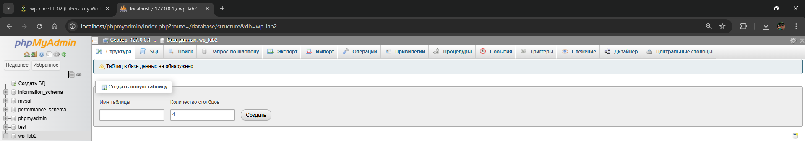
*Рисунок 1 — Запущенные модули Apache и MySQL в XAMPP Control Panel*

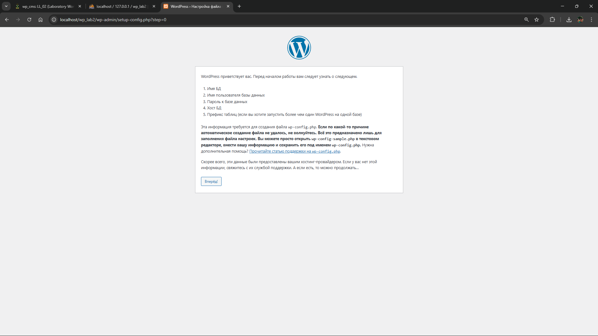
*Рисунок 2 — Интерфейс phpMyAdmin*

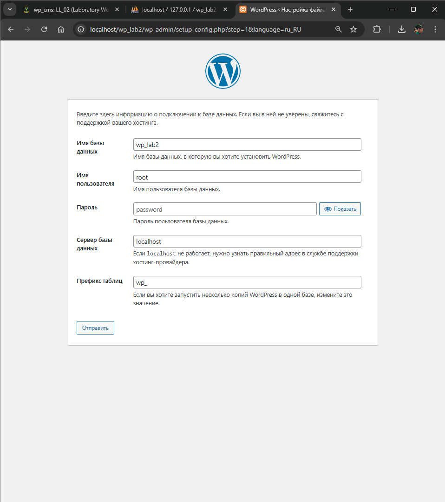
*Рисунок 3 — Создание базы данных wp_lab2*

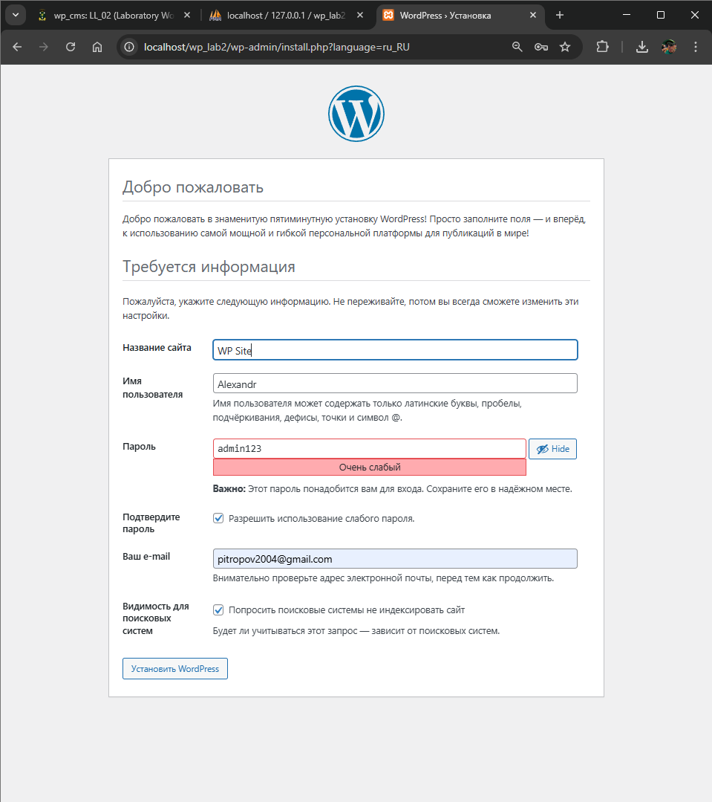
*Рисунок 4 — База данных wp_lab2 успешно создана*

---

### Шаг 2. Установка WordPress

WordPress версии **6.9.4** был скачан с официального сайта [wordpress.org](https://wordpress.org) и распакован в папку `C:\xampp\htdocs\wp_lab2`. После этого в браузере был открыт адрес `http://localhost/wp_lab2`, где был пройден мастер установки.

В процессе установки были указаны следующие данные:
- Имя базы данных: `wp_lab2`
- Имя пользователя БД: `root`
- Пароль: *(пустой)*
- Сервер: `localhost`
- Название сайта: `PitDev`
- Имя администратора: `Alexandr`

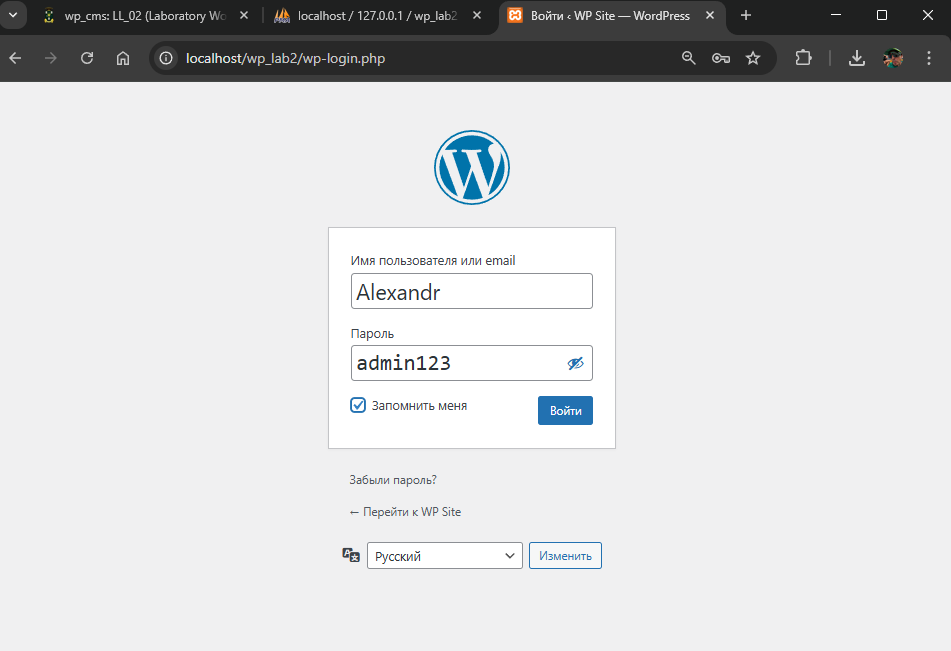
*Рисунок 5 — Приветственная страница установки WordPress*

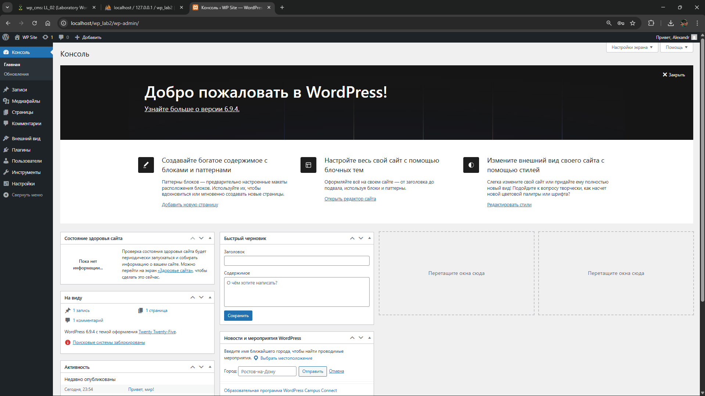
*Рисунок 6 — Форма подключения к базе данных*

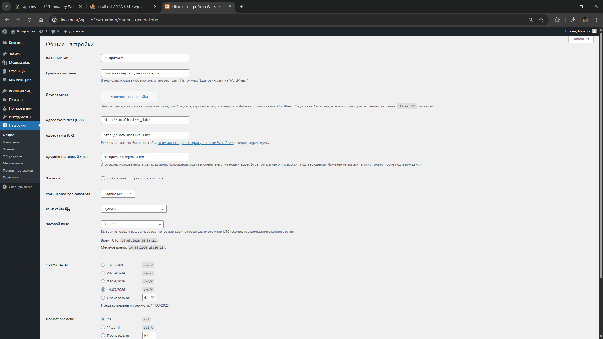
*Рисунок 7 — Форма ввода данных сайта*

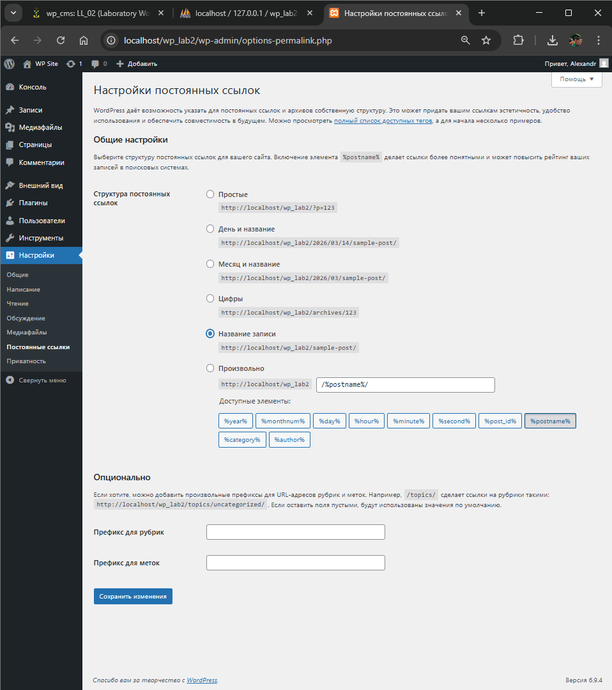
*Рисунок 8 — Страница входа в административную панель WordPress*

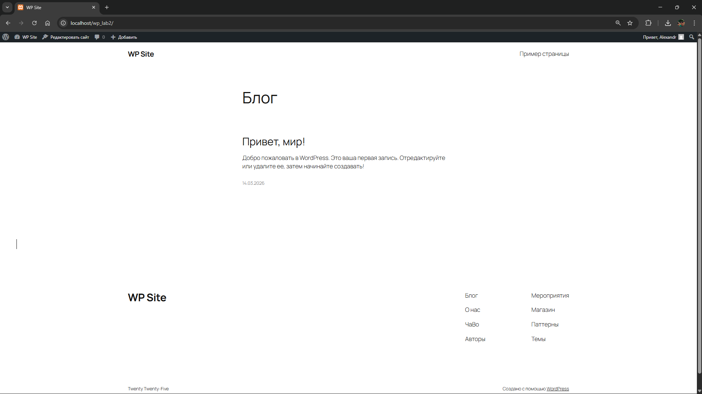
*Рисунок 9 — Главная страница административной панели WordPress*

---

### Шаг 3. Первоначальные настройки сайта

В разделе **Настройки → Общие** было изменено:
- Название сайта: `PitDev`
- Краткое описание: `Всё о мире Формулы 1`
- Часовой пояс: `UTC+2`

В разделе **Настройки → Постоянные ссылки** был выбран вариант **«Название записи»** (Post name), что обеспечивает удобные URL-адреса для записей, например: `http://localhost/wp_lab2/название-записи/`.

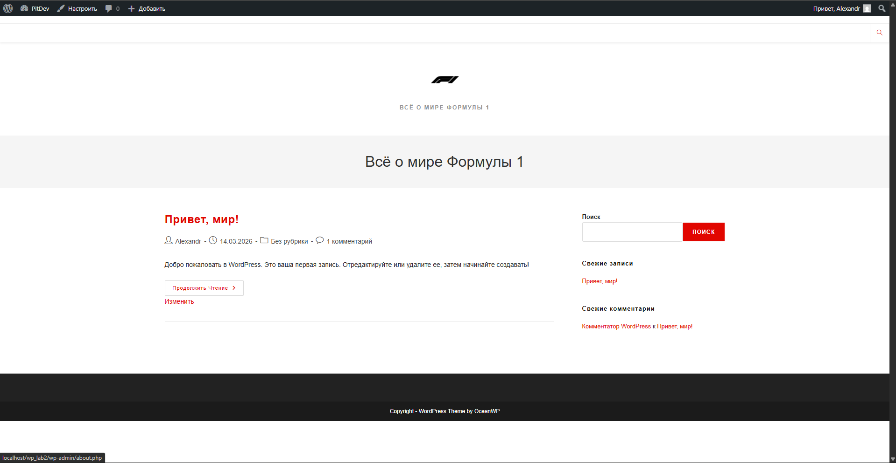
*Рисунок 10 — Общие настройки сайта (название, описание, часовой пояс)*

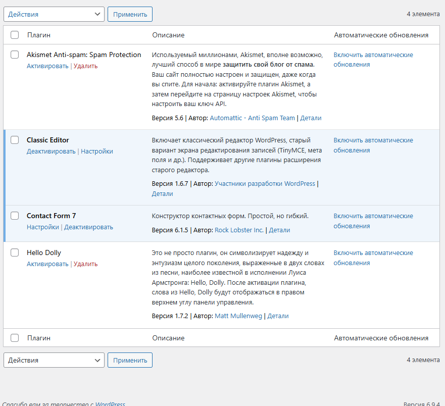
*Рисунок 11 — Настройки постоянных ссылок — выбран вариант «Название записи»*

---

### Шаг 4. Работа с темами

В разделе **Внешний вид → Темы** была установлена тема **OceanWP** из официального каталога WordPress. На рисунке 12 показан сайт со стандартной темой Twenty Twenty-Five до установки OceanWP, на рисунке 13 — после активации новой темы.

В меню **Внешний вид → Настроить** были выполнены следующие настройки:
- **Логотип:** загружен логотип Формулы 1
- **Цветовая схема:** основной цвет `#E10600` (официальный красный цвет F1)
- **Тип хедера:** по центру
- **Заголовок сайта:** `PitDev`
- **Описание:** `Всё о мире Формулы 1`

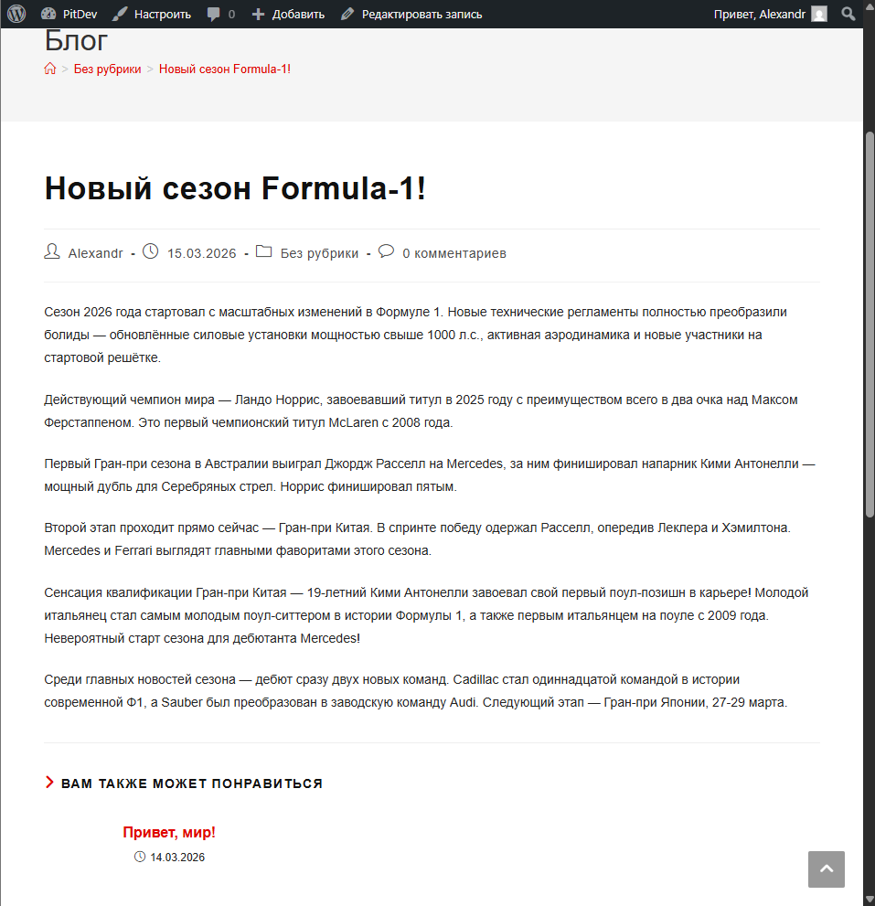
*Рисунок 12 — Сайт со стандартной темой Twenty Twenty-Five (до установки OceanWP)*

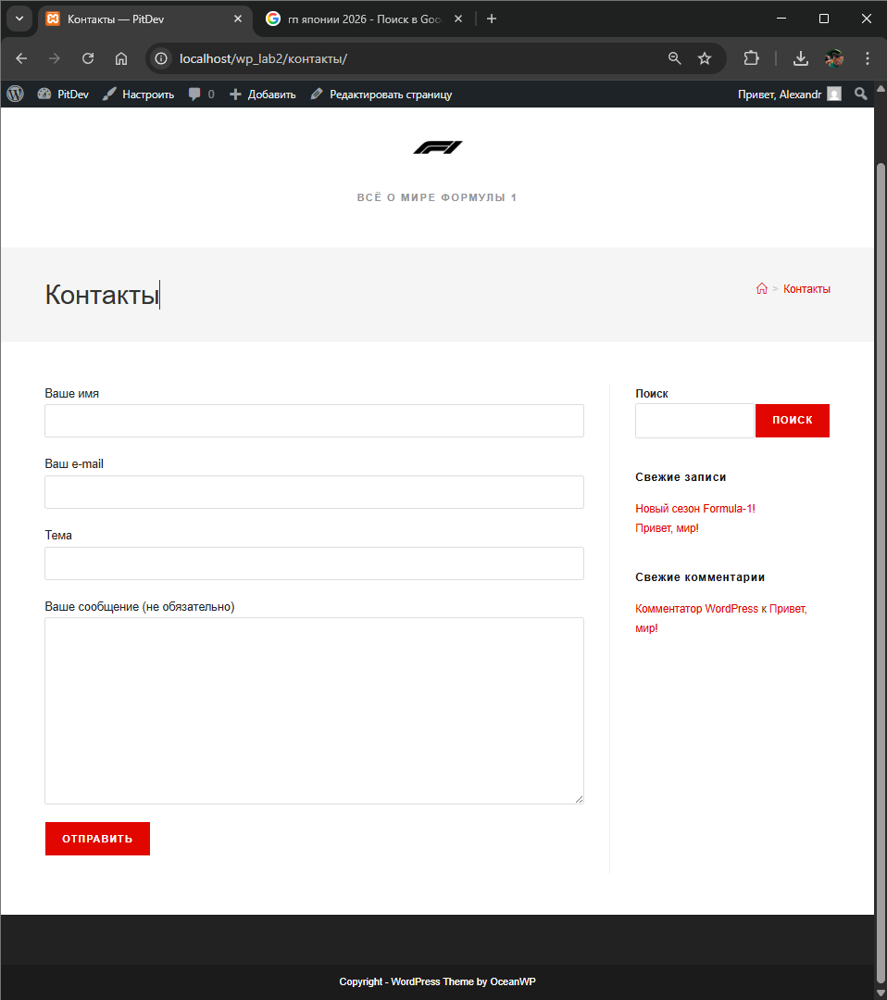
*Рисунок 13 — Сайт с активированной темой OceanWP и настроенным дизайном*

---

### Шаг 5. Работа с плагинами

В разделе **Плагины → Добавить новый** были установлены и активированы два плагина:

| Плагин | Назначение |
|--------|------------|
| **Classic Editor** | Классический редактор записей вместо блочного Gutenberg |
| **Contact Form 7** | Создание форм обратной связи |

После установки **Classic Editor** при создании новой записи открывается классический редактор с текстовым полем и панелью инструментов. После деактивации плагина редактор возвращается к стандартному блочному Gutenberg — классический интерфейс исчезает.

С помощью **Contact Form 7** была создана форма «Свяжитесь с нами — PitDev» с полями: имя, email, тема и сообщение.

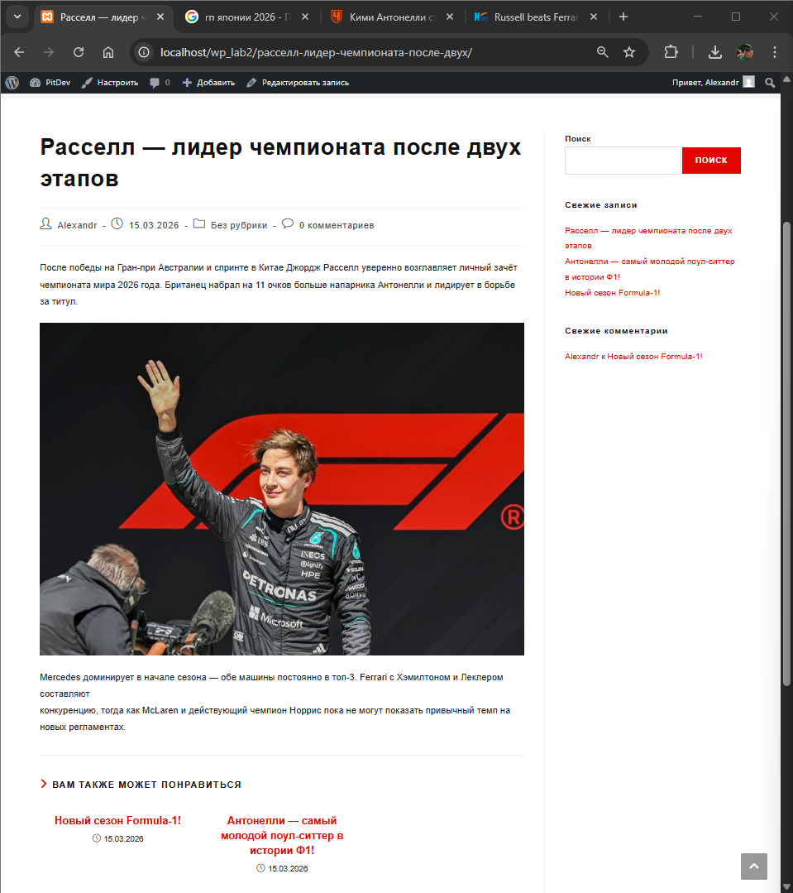
*Рисунок 14 — Список установленных плагинов*

---

### Шаг 6. Создание контента

Была создана страница **«Контакты»**, на которую вставлен шорткод контактной формы:

```
[contact-form-7 id="de5cfd1" title="Свяжитесь с нами!"]
```

В блоге созданы три записи с разным контентом:

1. **«Новый сезон Formula-1!»** — обзорная статья о сезоне 2026 года
2. **«Антонелли — самый молодой поул-ситтер в истории Ф1!»** — новость с фотографией
3. **«Расселл — лидер чемпионата после двух этапов»** — новость с фотографией

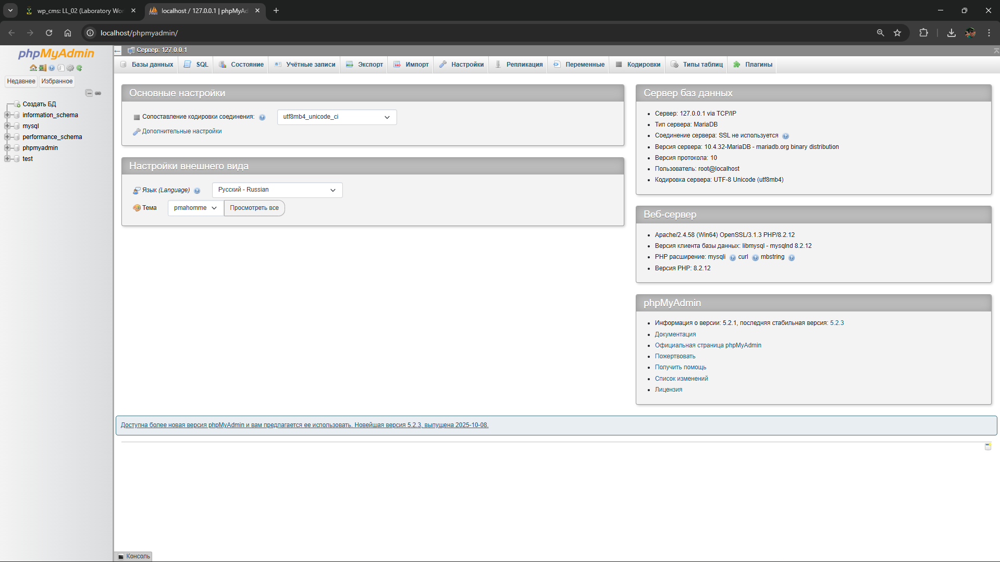
*Рисунок 15 — Страница «Контакты» с формой обратной связи*

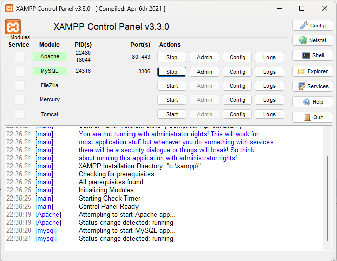
*Рисунок 16 — Запись блога «Новый сезон Formula-1!»*

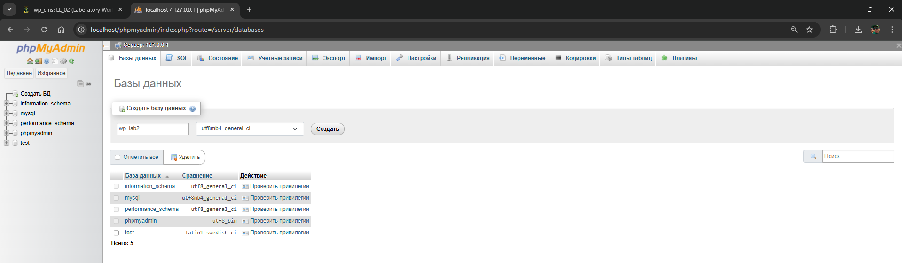
*Рисунок 17 — Запись блога «Расселл — лидер чемпионата после двух этапов» с фотографией*

---

## Ответы на контрольные вопросы

### 1. Что делает тема в WordPress, а что — плагин?

**Тема** отвечает за внешний вид сайта: структуру страниц, расположение элементов, шрифты, цвета и общий дизайн. Тема определяет то, *как сайт выглядит*, но не влияет на его функциональность.

**Плагин** расширяет функциональность сайта — добавляет новые возможности, которых нет в стандартном WordPress. Например, Contact Form 7 добавляет формы обратной связи, Classic Editor меняет интерфейс редактора. Плагины работают независимо от темы и могут использоваться с любой темой.

### 2. Почему при смене темы контент сайта не теряется?

Весь контент сайта (записи, страницы, комментарии, медиафайлы) хранится в **базе данных MySQL**, а не в файлах темы. Тема лишь определяет способ отображения этих данных. При смене темы WordPress продолжает использовать ту же базу данных, поэтому весь контент остаётся нетронутым — меняется только визуальное оформление.

### 3. Как можно изменить внешний вид сайта без редактирования кода?

WordPress предоставляет несколько способов:

1. **Внешний вид → Настроить** — встроенный инструмент для настройки темы в реальном времени: изменение цветов, логотипа, заголовка, меню и виджетов.
2. **Смена темы** — установка новой темы из официального каталога полностью меняет дизайн без изменения контента.
3. **Виджеты** — в разделе Внешний вид → Виджеты можно добавлять готовые блоки контента в боковые панели и подвал сайта.

---

## Вывод

В ходе выполнения лабораторной работы была успешно установлена и настроена локальная среда для работы с WordPress на основе XAMPP. Освоена административная панель WordPress, изучена работа с темами и плагинами. Создан тематический сайт **PitDev**, посвящённый Формуле 1, с настроенной темой OceanWP, плагинами Classic Editor и Contact Form 7, страницей контактов и тремя записями в блоге с актуальными новостями сезона 2026 года.