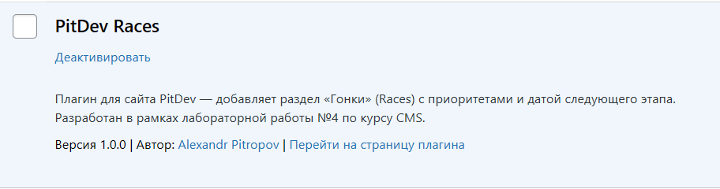
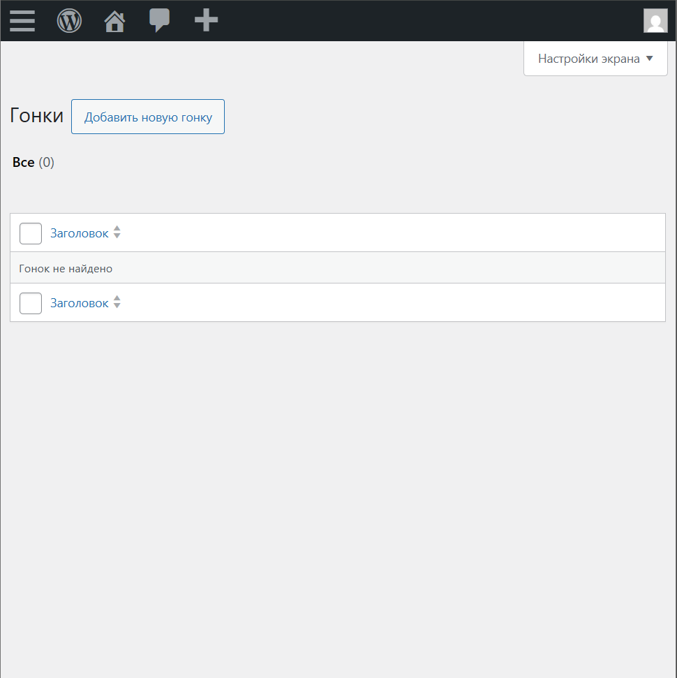
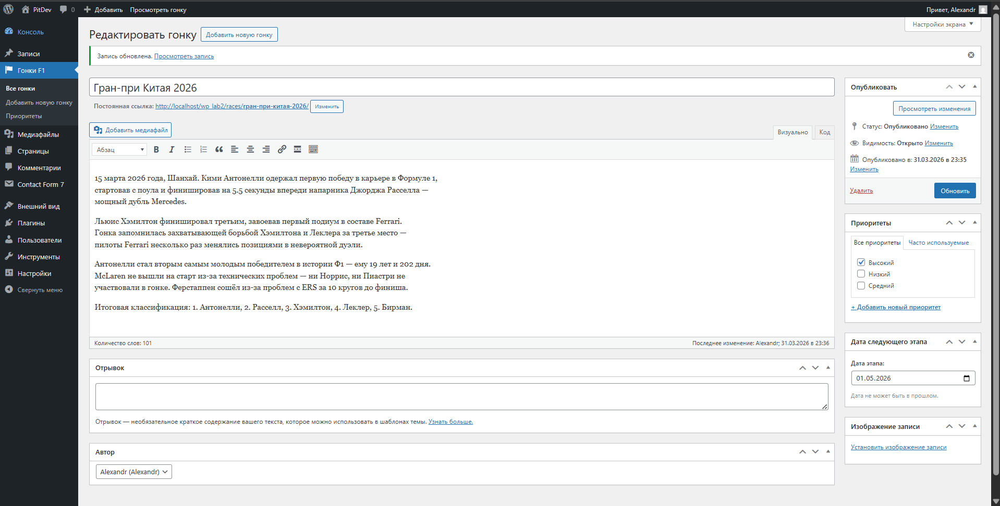
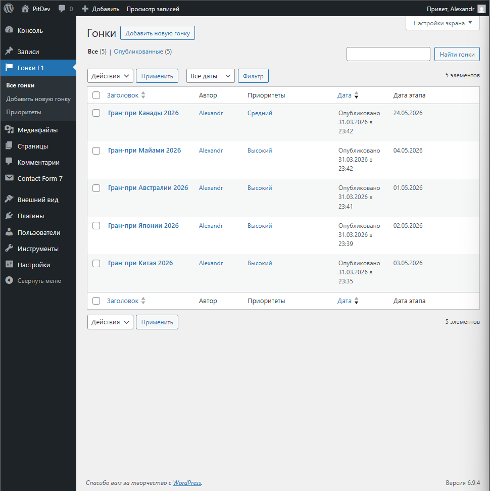
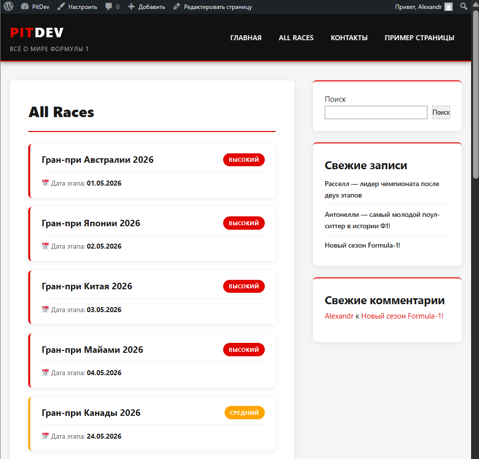

# Лабораторная работа №4. Разработка плагина для WordPress

**Выполнил:** Питропов Александр  
**Группа:** I2302  
**Дата:** 2026

---

## Инструкции по запуску проекта

1. Убедитесь что установлен **XAMPP** с запущенными модулями Apache и MySQL
2. Откройте папку `C:\xampp\htdocs\wp_lab2\wp-content\plugins\`
3. Скопируйте папку `pitdev-races` в эту директорию
4. Откройте браузер и перейдите по адресу `http://localhost/wp_lab2/wp-admin/`
5. Перейдите в **Плагины → Установленные плагины**
6. Найдите **PitDev Races** и нажмите **Активировать**
7. В меню админки появится раздел **Гонки F1**

---

## Описание лабораторной работы

Цель работы — освоить расширяемую модель данных WordPress: создать CPT, пользовательскую таксономию, метаданные с метабоксом и шорткод для отображения данных на сайте.

Плагин **PitDev Races** добавляет в сайт раздел «Гонки F1» с приоритетами этапов и датами проведения. Тема плагина продолжает концепцию сайта PitDev, посвящённого Формуле 1.

---

## Краткая документация к плагину

### Структура файлов

```
pitdev-races/
├── pitdev-races.php    # Основной файл плагина
└── pitdev-races.css    # Стили для шорткода
```

### Компоненты плагина

| Компонент | Описание |
|-----------|----------|
| CPT `pitdev_race` | Custom Post Type «Гонки» |
| Таксономия `pitdev_priority` | Приоритет этапа (Высокий/Средний/Низкий) |
| Метаполе `_pitdev_race_date` | Дата проведения этапа |
| Шорткод `[pitdev_races]` | Вывод списка гонок с фильтрами |

### Ключевые особенности реализации

**1. Регистрация Custom Post Type**

```php
register_post_type( 'pitdev_race', array(
    'public'      => true,
    'has_archive' => true,
    'menu_icon'   => 'dashicons-flag',
    'supports'    => array( 'title', 'editor', 'author', 'thumbnail', 'excerpt' ),
    'rewrite'     => array( 'slug' => 'races' ),
) );
```

**2. Регистрация таксономии**

```php
register_taxonomy( 'pitdev_priority', array( 'pitdev_race' ), array(
    'hierarchical'      => true,
    'show_admin_column' => true,
    'rewrite'           => array( 'slug' => 'priority' ),
) );
```

**3. Метабокс с валидацией и nonce**

```php
// Добавление метабокса
add_meta_box( 'pitdev_race_date', 'Дата этапа', 'callback', 'pitdev_race', 'side' );

// Сохранение с проверкой nonce
if ( ! wp_verify_nonce( $_POST['pitdev_race_date_nonce'], 'pitdev_save_race_date' ) ) {
    return;
}

// Валидация: дата не в прошлом
if ( $date < date( 'Y-m-d' ) ) {
    set_transient( 'pitdev_race_date_error_' . $post_id, 'Дата не может быть в прошлом!', 45 );
    return;
}
```

**4. Шорткод с фильтрами**

```php
add_shortcode( 'pitdev_races', 'pitdev_races_shortcode' );

function pitdev_races_shortcode( $atts ) {
    $atts = shortcode_atts( array(
        'priority'    => '',
        'before_date' => '',
    ), $atts );
    // ... WP_Query с tax_query и meta_query
}
```

**5. Автоматическое создание приоритетов при активации**

При активации плагина автоматически создаются три термина таксономии: Высокий (high), Средний (medium), Низкий (low).

---

## Примеры использования плагина

### Активация плагина


*Рисунок 1 — Плагин PitDev Races в списке установленных плагинов WordPress*

### CPT в админке


*Рисунок 2 — Custom Post Type «Гонки F1» в меню административной панели*

### Метабокс с датой


*Рисунок 3 — Метабокс для ввода даты этапа с валидацией и таксономией приоритетов*

### Список гонок


*Рисунок 4 — Список гонок в админке с колонкой даты этапа и приоритетами*

### Шорткод на странице

Шорткод — все гонки:
```
[pitdev_races]
```

Шорткод — только высокоприоритетные:
```
[pitdev_races priority="high"]
```

Шорткод — гонки до определённой даты:
```
[pitdev_races before_date="2026-06-01"]
```


*Рисунок 5 — Страница «All Races» с отображением шорткодов [pitdev_races]*

---

## Ответы на контрольные вопросы

### 1. Чем пользовательская таксономия принципиально отличается от метаполя?

**Таксономия** — это система классификации записей по категориям/тегам. Термины таксономии являются отдельными объектами базы данных, могут иметь собственные страницы архивов, и несколько записей могут разделять один термин.

**Метаполе** — это произвольные данные, привязанные к конкретной записи. Метаполе хранит уникальное значение для каждой записи отдельно.

**Пример выбора:**
- **Таксономия** — когда нужна классификация с повторяющимися значениями. Например, приоритет гонки (Высокий/Средний/Низкий) — одно и то же значение применяется к множеству записей, нужна фильтрация по архиву.
- **Метаполе** — когда данные уникальны для каждой записи. Например, дата конкретного этапа (`_pitdev_race_date`) — у каждой гонки своя дата, не нужна страница архива по дате.

### 2. Зачем нужен nonce при сохранении метаполей и что произойдёт, если его не проверять?

**Nonce** (number used once) — это одноразовый токен безопасности, который WordPress генерирует для каждой формы. Он привязан к конкретному действию, пользователю и временному окну.

**Зачем нужен:**
- Защита от **CSRF-атак** (Cross-Site Request Forgery) — злоумышленник не может заставить браузер пользователя отправить поддельный запрос на сохранение данных.
- Гарантия что запрос пришёл именно с нашей формы, а не с внешнего сайта.

**Что произойдёт без проверки:**
- Злоумышленник может создать страницу, которая при посещении администратором автоматически отправит запрос на изменение данных в WordPress.
- Возможна подмена метаданных любых записей без ведома владельца сайта.
- WordPress сам не защитит от таких атак — ответственность полностью на разработчике плагина.

### 3. Какие аргументы `register_post_type()` и `register_taxonomy()` чаще всего важны для фронтенда и UX?

**Для `register_post_type()`:**

1. **`public => true`** — делает CPT доступным на фронтенде. Без этого записи не будут отображаться на сайте, только в админке.

2. **`has_archive => true`** — создаёт страницу архива (`/races/`), где выводятся все записи CPT. Важно для навигации и SEO.

3. **`rewrite => array('slug' => 'races')`** — задаёт понятный URL для записей (`/races/grand-prix-australia/`). Влияет на UX и SEO — красивые URL лучше воспринимаются пользователями.

**Для `register_taxonomy()`:**

1. **`hierarchical => true`** — делает таксономию похожей на категории (с вложенностью), а не на теги. В UI это означает чекбоксы вместо текстового поля, что удобнее для фиксированных значений (Высокий/Средний/Низкий).

2. **`show_admin_column => true`** — показывает колонку с таксономией в списке записей CPT в админке. Позволяет сразу видеть приоритет каждой гонки без открытия записи.

3. **`public => true`** — создаёт архивные страницы для терминов таксономии (например `/priority/high/`), что позволяет пользователям фильтровать записи по приоритету прямо на сайте.

---

## Список использованных источников

1. [WordPress Plugin Handbook](https://developer.wordpress.org/plugins/)
2. [register_post_type() — WordPress Developer](https://developer.wordpress.org/reference/functions/register_post_type/)
3. [register_taxonomy() — WordPress Developer](https://developer.wordpress.org/reference/functions/register_taxonomy/)
4. [add_meta_box() — WordPress Developer](https://developer.wordpress.org/reference/functions/add_meta_box/)
5. [add_shortcode() — WordPress Developer](https://developer.wordpress.org/reference/functions/add_shortcode/)
6. [wp_nonce_field() — WordPress Developer](https://developer.wordpress.org/reference/functions/wp_nonce_field/)

---

## Дополнительные важные аспекты

### Безопасность при сохранении метаполей

В плагине реализована трёхуровневая защита при сохранении данных:
1. **Nonce** — проверка подлинности запроса
2. **Автосохранение** — пропуск при автосохранении WordPress
3. **Права доступа** — проверка `current_user_can('edit_post')`

### Хук активации плагина

При активации плагин автоматически:
- Регистрирует CPT и таксономию
- Сбрасывает правила перезаписи URL (`flush_rewrite_rules`)
- Создаёт термины приоритетов (Высокий/Средний/Низкий)

### WP_Query с комбинированными фильтрами

Шорткод поддерживает одновременную фильтрацию по таксономии (`tax_query`) и метаполю (`meta_query`), что позволяет гибко выбирать нужные записи.
